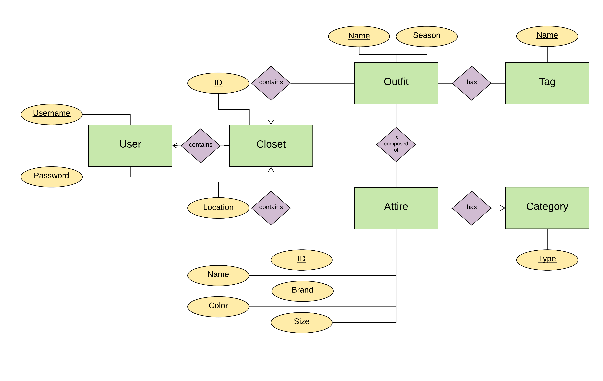
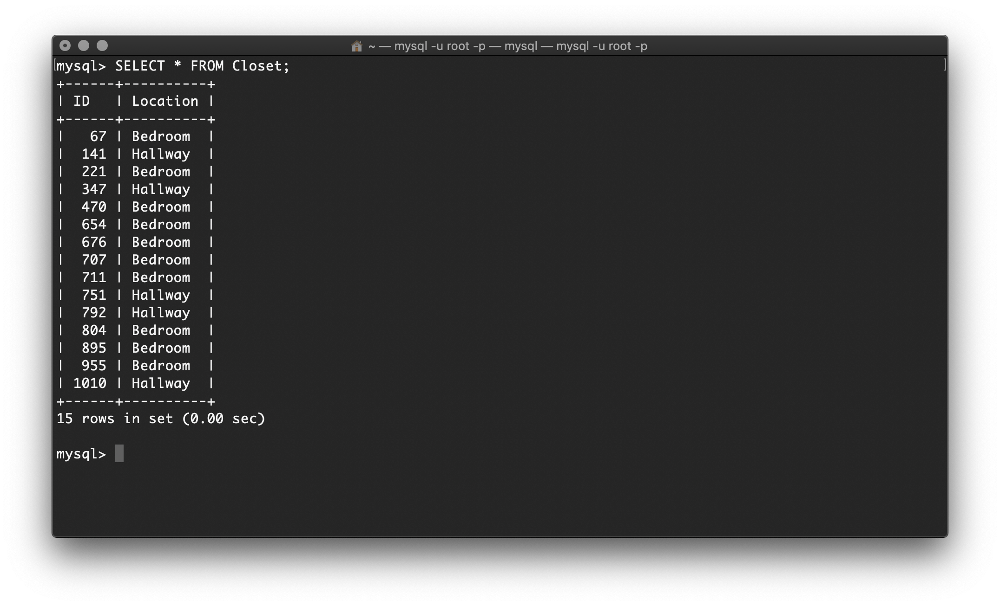
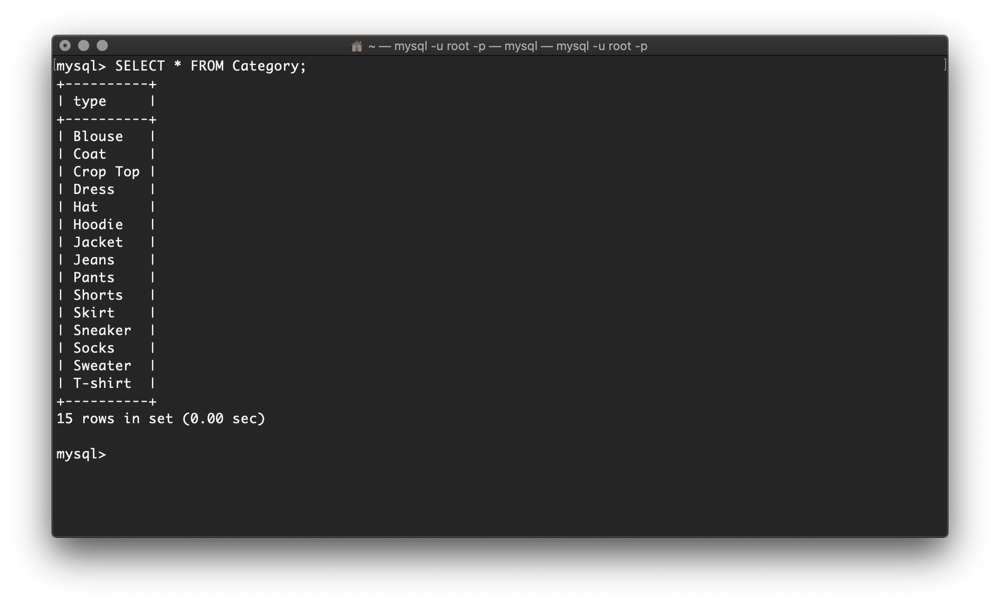
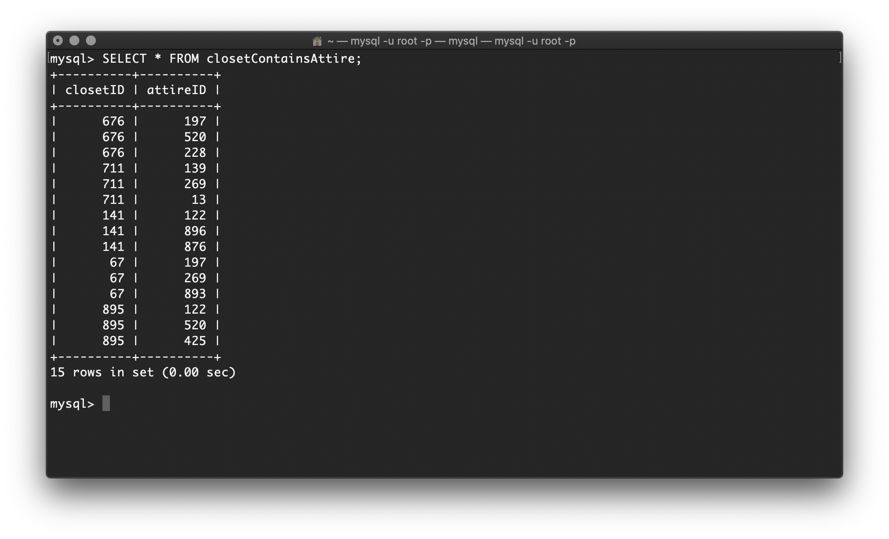
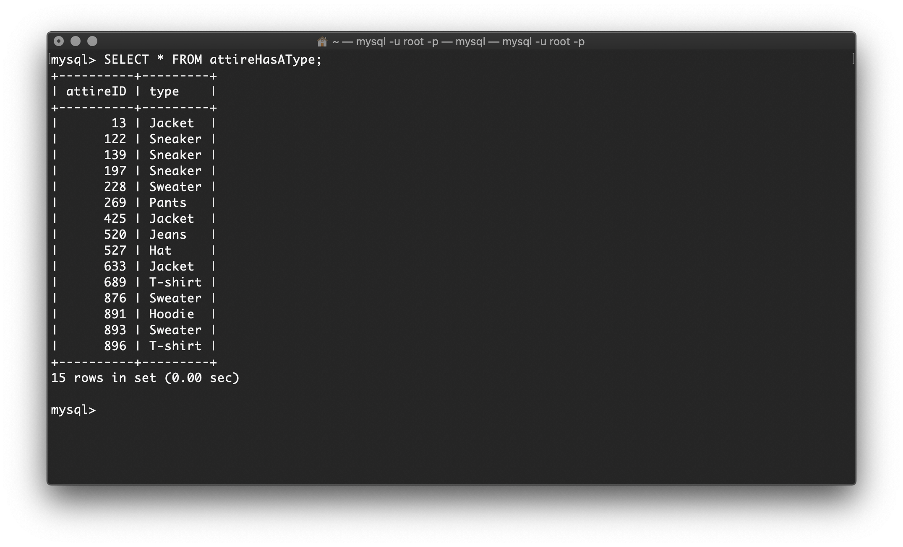

# whatdoiwear.today - Project Data Model and Database Design v2

## Entity / Relationship Diagram

## Entity Set Descriptions

### User

User is an entity set with two attributes: a unique username and password. They key of User is the username attribute. The User entity set represents users of the application and their login information.

### Closet

Closet is an entity set corresponding to a User's physical closet. The key of a Closet is the ID attribute. The Closet entity set consists of a collection of clothing the users save as outfits (multiple clothing pieces) or as attire (individual clothing pieces).

### Outfit

The Outfit entity set has two attributes: a unique name and a season. The key of an Outfit is the name. The Outfit entity set consists of "mini-collections" of clothing pieces that the users save as outfits.

### Attire

The Attire entity set has five attributes: ID, name, brand, color, and size. The key of an Attire is the ID. The Attire entity set consists of all the individual clothing pieces the users save.

### Category

The Category entity set has one attribute: type. This entity set serves to categorize pieces of Attire into types such as T-shirts, pants, etc.

### Tag
The Tag entity set has one attribute Name. This entity set serves to categorize collections of Outfits into different outfit catalogs as the users wish, such as Formal wear, Casual wear, outfits categorized by seasons, etc.

## Relationship Descriptions

### User "owns a" Closet

A User owns zero to many Closet(s), but a Closet is owned by exactly one User. A User may exist without a Closet, and a Closet cannot exist without a User.

### Closet "contains" Outfit(s)

A Closet contains zero to many outfits, whereas an outfit is contained in to exactly one User's Closet.

### Closet "contains" Attire

A Closet contains zero to many pieces of Attire, whereas a piece of Attire is contained in exactly one User's Closet.

### Outfit "is composed of" Attire

An Outfit is composed of one or more pieces of Attire.

### Attire "has a" Type

A piece of Attire has exactly one Category type (e.g. sweater, shoes), whereas a Category type is encompassed by zero to many piece(s) of Attire.

### Outfit "has a" Tag

In order to allow for the user to add more relevant information to an Outfit for filtering purposes, a User may associate an Outfit with zero to many Tag(s), whereas a Tag may be associated with zero to many Outfit(s).

## Database Schema

### Entity Sets

* User (<ins>username</ins>, password)
* Closet (<ins>ID</ins>, location)
* Outfit (<ins>name</ins>, season)
* Attire (<ins>ID</ins>, name, brand, color, size)
* Category (<ins>type</ins>)
* Tag (<ins>name</ins>)

### Relationships

* Owns (username, closetID)
* closetContainsOutfit (closetID, outfitName)
* closetContainsAttire (closetID, attireID)
* IsComposedOf (outfitName, attireID)
* attireHasAType (attireID, type)
* outfitHasATag (outfitName, tagName)

## Tables

### Entity Set Tables

* User

* Closet

* Outfit

* Attire

* Category

* Tag

### Relationships Tables

* Owns

* closetContainsOutfit

* closetContainsAttire

* IsComposedOf

* attireHasAType

* outfitHasATag

