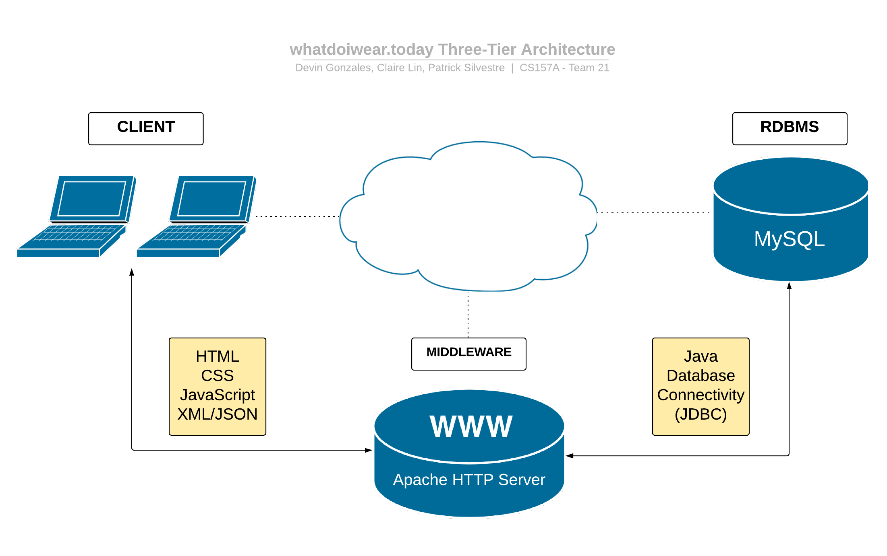

# whatdoiwear.today - Project Requirements

## Team 21

* [Devin Gonzales](https://github.com/DJGonzales96)
* [Claire Lin](https://github.com/clairelin23)
* [Patrick Silvestre](https://github.com/pjsilvestre)

## Project Description in Detail

### Goal

The goal of this project is to facilitate a user-friendly application capable of providing users with a convenient way to collect, organize and share various articles of clothing in an ever growing market of apparel. Users will be presented with recommended outfits based on their current clothing selection and supplied with sufficient collection, sorting and searching options in their wardrobe as well as a comfortable GUI to aid user interaction.

### Motivation

This project was inspired by an absence in similar applications among the industry. Music, TV, and literature are all examples of domains with limitless streaming, collection and sharing capabilities. The fashion industry is a comparably large source of income expenditure among multiple demographics with very limited technical representation. This application seeks to bring similar functionality of other social media or streaming services by allowing users to share and collect their favorite clothing items and brands in an adaptable, easy to follow format.

### Stakeholders

* Students / Young Adults; Women; Professionals
  * This demographic has the desire to maintain a fashionable appearance.
  * In addition, they often have physical closets and often look for ways reduce time spent on outfit planning.

* Project Team
  * The team is concerned with creating and maintaining the app as necessary.

### Application Domain

This application will be based in the fashion and clothing domain.

### User Benefits

* Clear Clothing Organization
  * Users will be able to come up with outfit ideas more conveniently as they can clearly view their entire closet.
  * Users will no longer need to go through the steps of pulling out a piece of clothing from physical closet, try to pair it with another piece, and put/fold it back if not satisfied with the pairing. Users can decide their outfits in the application, and pick out the specific pieces in their physical closet.

* Reduced Spending on Clothing
  * Users will be able to avoid buying clothing similar to the ones they already own. The application provides an easy and organized view of the user's entire clothing collection.  

* Find out personal style
  * Users will be able to discover their personal clothing preferences by viewing what clothing pieces they wear the most often. 

## System Environment in Detail

### Structure

### Hardware/Software

* Development Operating Systems
  * macOS Mojave
  * Windows 10
* IDEs
  * Eclipse
  * IntelliJ IDEA

### RDBMS

* MySQL 8.0.17

### Web Server

* Apache Tomcat

### Application Languages / Interfaces

* Java
* Java Database Connectivity (JDBC)
* XML / JSON
* HTML
* CSS
* JavaScript
* JSP

## Functional Requirements in Detail

### Account Creation and Login

* New users will be able to create accounts.
* Returning users will be able to log in to their accounts.

### Requesting Pieces

* Users will be able to search for a piece of clothing via search box by inputting descriptors such as item type and brand. Additionally, users will be able to narrow their search through additional characteristic checkboxes, such as gender, size, and material.
* The application will present a list of clothing pieces that are the closest match for the given search parameter. In the event no clothing articles match the given search parameters, the user will be notified no pieces could be found.

### Adding Pieces

* Users will be able to add a piece of clothing to their collection through an on-screen prompt.
* Users will be able to uplaod a picture of the clothing and enter text descriptions of the clothing, such as type, brand,   
color, size, material type, and gender. 
* The application will store this piece of clothing and all relevant information in the users wardrobe collection.

### Viewing the Closet

* Users will be able to view their collected clothing articles in a list format. Additionally, users will be able to sort their wardrobe via various clothing characteristics.
* The application will retrieve all aggregated clothing articles in a user's saved collection and display them for view in a separate page.
* The user will also be able to see their most frequently and least frequently worn pieces.

### Updating Pieces

* Users will be able to edit information/characteristics of an existing clothing in their collection.
* The application will save the edited information.

### Removing Pieces

* Users will be able to remove existing pieces from their collection.

### Saving Favorite Outfits

* Users will be able to create an outfit by selecting several existing pieces in their collection.
* The outfits will be stored in an outfit list within the user's collection and can be browsed through.

## Non-Functional Issues in Detail

### Graphical User Interface

The team strives to create an aesthetic graphical user interface that aims to exhibit the best qualities of user interface design, from clarity to consistency. The front end will be built using a combination of custom CSS, in addition to the potential usage of third-party frameworks such as Bootstrap.

* Account Creation and Login
  * Upon opening the app, the user will be greeted with a login form, in addition to a link to an account creation form.
    * The account creation form will be similar in nature to that of the login form.
  * After successful login, the user will be presented with the main screen of the app, a visual display of their current closet, in addition to a navigation bar used for accessing additional functions.

* Requesting Pieces
  * The navigation bar will feature an option for requesting pieces.
  * Once the user opts to request a piece, a search bar will appear, allowing for user input.
  * Once the user finishes entering their input, the closet will reflect the result of their search.

* Viewing the Closet
  * The user can freely browse their closet, with pieces represented via text and images.
  * The GUI will reflect any constraints set by the user, such as if a user opts to see all shirts by a certain brand.

* Adding, Updating, and Removing Pieces
  * The navigation bar will feature options for adding, updating, and removing pieces.
  * When the user chooses to add a new piece, the app will present an easy-to-use form, allowing for user input.
  * When updating and/or removing pieces, the app will present current information on a piece, in addition to confirming any changes/deletions.

* Saving Favorite Outfits
  * When assembling an outfit, the app will show the different pieces in the outfit as the user picks and chooses.

### Security

We aim to ensure that a given user can see only their closet, and that a given closet can only be seen by its respective user. Security will be implemented through the use of basic access authentication, that is, a user name and password when making HTTP requests.

### Access Control

Access control will be role-based. Standard users will be allowed to perform normal functions as described by our functional requirements (e.g. adding clothes, viewing the closet, etc.). Admin users will be allowed to perform additional functions to ensure proper functionality of the database application.
